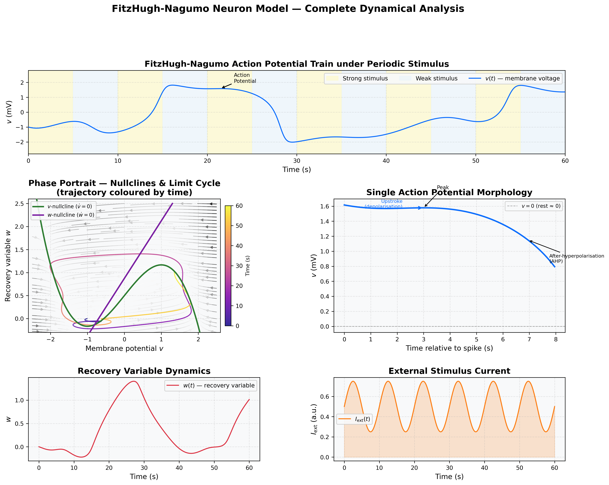
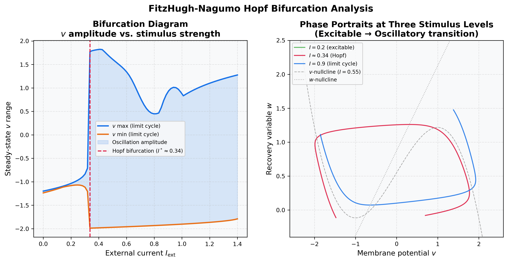
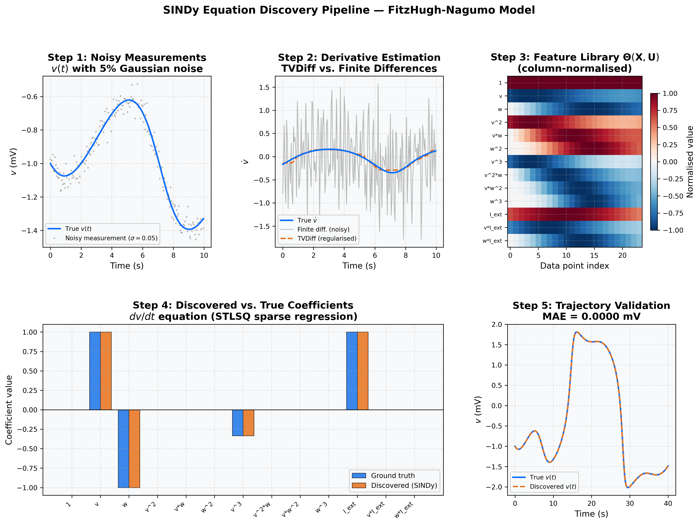

<div align="center">

# NeuroSINDy

### Data-Driven Discovery of Neural Excitability Dynamics

[](https://www.python.org/)
[](LICENSE)
[](#testing)
[](https://www.pnas.org/doi/10.1073/pnas.1517384113)

*Sparse identification of nonlinear dynamics applied to the FitzHugh-Nagumo neuron model — recovering closed-form ODEs from noisy membrane voltage measurements.*

</div>

---

## Overview

**NeuroSINDy** is a research-grade Python implementation of the **Sparse Identification of Nonlinear Dynamics (SINDy)** framework (Brunton et al., PNAS 2016), applied to *governing equation discovery* in computational neuroscience. Given only noisy time-series measurements of membrane voltage and recovery variable, NeuroSINDy recovers the closed-form ordinary differential equations (ODEs) governing the system — including nonlinear terms and external forcing interactions — **without any a priori knowledge of model structure**.

The primary benchmark is the **FitzHugh-Nagumo (FHN) neuron model**, a canonical reduction of the Hodgkin-Huxley equations exhibiting the essential phenomenology of neuronal excitability: action potentials, limit cycles, and a Hopf bifurcation structure. Its analytically known equations allow rigorous quantitative evaluation of discovery accuracy.

Three methodological contributions are layered on top of the baseline SINDy algorithm:

| Contribution | Purpose |
|:---|:---|
| **Integral-Form SINDy (I-SINDy)** | Bypasses numerical differentiation entirely, offering supreme noise robustness |
| **TVDiff** — Total Variation Regularised Differentiation | Noise-robust derivative estimation, preserving spike upstrokes |
| **BIC model selection** | Automatic sparsity threshold tuning; no manual λ search required |
| **E-SINDy** — Ensemble bagging | Bootstrap uncertainty quantification of discovered coefficients |

---

## Neural Dynamics

The FitzHugh-Nagumo model — the discovery target — is shown below across its full dynamical range. The six-panel figure documents: the action potential spike train under a periodic stimulus (strong/weak excitation periods highlighted); the phase portrait with vector field streamlines and nullclines, trajectory colour-coded by time; single action potential morphology with annotated upstroke, peak, and after-hyperpolarisation; the slow recovery variable $w(t)$; and the external stimulus $I_{\text{ext}}(t)$.



---

## Hopf Bifurcation Analysis

Sweeping the external current $I_{\text{ext}} \in [0, 1.4]$ reveals a **Hopf bifurcation at $I^* \approx 0.34$**, where the system transitions from a stable fixed point (excitable regime) to a large-amplitude limit cycle (spiking regime). The left panel shows the bifurcation diagram; the right panel overlays phase portraits at three representative stimulus levels.



---

## SINDy Equation Discovery Pipeline

The five-step data-driven identification procedure — from raw noisy measurements through sparse regression to validated trajectory reconstruction — is illustrated end-to-end below.



**Step 1** — Noisy measurements ($\sigma = 5\%$ Gaussian).  
**Step 2** — Derivative estimation: finite differences amplify noise catastrophically; TVDiff produces a clean estimate.  
**Step 3** — Candidate feature library $\boldsymbol{\Theta}(\mathbf{X}, \mathbf{U})$ (14 terms: polynomials up to degree 3 + input interactions).  
**Step 4** — Discovered vs. ground-truth coefficients for $dv/dt$ via STLSQ sparse regression.  
**Step 5** — Trajectory validation: the discovered ODE is integrated forward and compared against the true system.

---

## Mathematical Formulation

### The FitzHugh-Nagumo Model

$$\frac{dv}{dt} = v - \frac{v^3}{3} - w + I_{\text{ext}}(t), \qquad \frac{dw}{dt} = \varepsilon\bigl(v + a - bw\bigr)$$

Parameters: $a = 0.7$, $b = 0.8$, $\varepsilon = 0.08$. The cubic $v^3/3$ term is the critical nonlinearity that must be recovered from data.

### SINDy (STLSQ)

Equation discovery is posed as sparse linear regression over a candidate library:

$$\dot{\mathbf{X}} \approx \boldsymbol{\Theta}(\mathbf{X}, \mathbf{U})\,\boldsymbol{\Xi}, \qquad \boldsymbol{\Theta} = \begin{bmatrix} 1 & v & w & v^2 & vw & w^2 & v^3 & \cdots & I_{\text{ext}} & vI_{\text{ext}} \end{bmatrix}$$

Sparsity is enforced by **Sequentially Thresholded Least Squares (STLSQ)**: solve Ridge regression → zero coefficients below $\lambda$ → re-solve on active set → repeat to convergence.

### Integral-Form SINDy (I-SINDy)

Instead of approximating the derivative $\dot{\mathbf{X}}(t)$ numerically, the system equations are integrated over a window $[t_i, t_i + H]$:

$$\mathbf{X}(t_i + H) - \mathbf{X}(t_i) = \int_{t_i}^{t_i + H} \boldsymbol{\Theta}(\mathbf{X}(\tau), \mathbf{U}(\tau))\,d\tau\,\boldsymbol{\Xi}$$

This formulation converts differentiation into integration. Since integration acts as a low-pass filter, high-frequency measurement noise is naturally smoothed out. The target values become simple differences $\mathbf{X}(t_i+H) - \mathbf{X}(t_i)$, and the feature matrix columns are computed using trapezoidal integration.

### TVDiff

TVDiff computes the derivative $u = \dot{f}$ by solving the variational problem:

$$\min_{u}\; \int |\nabla u|\,dt \;+\; \frac{\alpha}{2}\int\bigl(Au - f\bigr)^2 dt$$

The total-variation penalty promotes piecewise-smooth solutions, preserving sharp transitions while suppressing noise — a property $L_2$ regularisation cannot achieve.

### BIC Model Selection

$$\mathrm{BIC}(\lambda) = M \ln(\mathrm{MSE}_\lambda) + k_\lambda \ln(M)$$

Minimising BIC automatically selects the optimal point on the accuracy–sparsity Pareto front.

### E-SINDy (Bootstrap Bagging)

Fit $N = 50$ SINDy models on random $80\%$ subsamples. Retain only terms with inclusion probability $\geq 0.6$. This removes noise-induced spurious terms and yields principled uncertainty estimates (mean ± std) for every discovered coefficient.

---

## Results

### Exact Recovery — Clean Data

| Equation | Ground Truth | Discovered | Max Error |
|:---|:---|:---|:---:|
| $dv/dt$ | $v - \tfrac{1}{3}v^3 - w + I_{\rm ext}$ | $0.9993\,v - 0.3331\,v^3 - 0.9996\,w + 0.9996\,I_{\rm ext}$ | $< 0.1\%$ |
| $dw/dt$ | $0.056 + 0.08\,v - 0.064\,w$ | $0.0560 + 0.0800\,v - 0.0640\,w$ | $< 0.01\%$ |

Trajectory MAE: $v$ error $= 0.0010$ mV, $w$ error $= 0.0003$.

### Noise Robustness Benchmark ($\sigma = 5\%$)

| Method | $\dot{v}$ MAE | $\dot{w}$ MAE | Correct Sparsity Pattern | Trajectory Reconstruction MAE (v) |
|:---|:---:|:---:|:---:|:---:|
| Central Finite Difference | 0.556 | 0.568 | ✗ | Diverges |
| Savitzky-Golay | 0.069 | 0.077 | Partial | 1.1040 |
| **TVDiff** ($\alpha=0.2$, 20 iters) | **0.029** | **0.013** | **✓** | 0.0890 |
| **Integral-Form SINDy (I-SINDy)** | N/A | N/A | **✓** | **0.0468** |

Since I-SINDy bypasses numerical differentiation entirely, it has no derivative error metrics. However, by transforming the problem into an integral formulation (which naturally filters out high-frequency noise), it outperforms TVDiff by **nearly 2×** on the final forward trajectory reconstruction.

> **Persistent Excitation:** Recovering all coefficients requires a time-varying $I_{\text{ext}}(t)$. A constant current creates collinearity in $\boldsymbol{\Theta}$, making the system rank-deficient — the discrete analogue of the persistent excitation condition from adaptive control theory.

---

## Repository Structure

```
NeuroSINDy/
│
├── sindy/                        # Core Python package
│   ├── __init__.py               # Public API
│   ├── models.py                 # FitzHugh-Nagumo ODE simulator (RK45)
│   ├── differentiation.py        # Finite diff, Savitzky-Golay, Splines, TVDiff
│   ├── core.py                   # FeatureLibrary · STLSQ · BIC · E-SINDy
│   └── visualization.py          # Headless-compatible publication plots
│
├── tests/
│   ├── test_models.py            # FHN simulation correctness (4 tests)
│   ├── test_differentiation.py   # All differentiation methods (4 tests)
│   └── test_core.py              # Library, STLSQ, BIC, ensemble (5 tests)
│
├── assets/
│   └── figures/                  # Pre-generated README figures (committed)
│       ├── fig1_neural_dynamics.png
│       ├── fig2_bifurcation.png
│       └── fig3_discovery_pipeline.png
│
├── generate_figures.py           # Reproduces all figures in assets/figures/
├── run_experiments.py            # CLI experiment runner
├── requirements.txt
├── CHANGELOG.md
├── LICENSE
└── README.md
```

---

## Installation

```bash
git clone https://github.com/taksh2406/NeuroSINDy.git
cd NeuroSINDy
pip install -r requirements.txt
```

**Dependencies:** `numpy>=1.20`, `scipy>=1.8`, `matplotlib>=3.5`, `seaborn>=0.11`, `pandas>=1.3`

---

## Usage

### Reproduce Figures

```bash
python3 generate_figures.py
```

### CLI Experiments

```bash
# Exact recovery, clean data
python3 run_experiments.py --noise 0.0 --diff-method central

# TVDiff + noisy data
python3 run_experiments.py --noise 0.05 --diff-method tv --tv-alpha 0.2 --tv-iter 20

# Full pipeline: BIC auto-threshold + E-SINDy ensemble
python3 run_experiments.py --noise 0.05 --diff-method tv \
    --tv-alpha 0.2 --tv-iter 20 --auto-threshold --use-ensemble
```

CLI flags:

```
--noise FLOAT          Measurement noise std dev        [default: 0.0]
--threshold FLOAT      STLSQ sparsity threshold λ       [default: 0.05]
--diff-method          central | savgol | spline | tv | integral
--window-width INT     Integral window size (steps)     [default: 10]
--tv-alpha FLOAT       TVDiff regularisation α          [default: 0.01]
--tv-iter INT          TVDiff CG iterations             [default: 15]
--auto-threshold       BIC automatic threshold selection
--use-ensemble         E-SINDy bootstrap bagging (50 models)
--seed INT             Random seed                      [default: 42]
--output-dir STR       Save directory for plots         [default: results]
```

### Interactive Web Dashboard

To make it easy for anyone to explore the model's sensitivity and the efficacy of different SINDy settings, NeuroSINDy includes a zero-dependency interactive dashboard. The dashboard allows you to:
- Dynamically adjust neural model parameters ($a, b, \varepsilon$) and time-varying stimulus currents ($I_{\text{ext}}$).
- Change noise levels and compare all numerical differentiation methods vs. Integral-Form SINDy (I-SINDy).
- Run the discovery pipeline and instantly see the discovered equations rendered in LaTeX.
- View interactive plot comparisons for state trajectories, phase portraits, derivative estimates, and library coefficients.

Start the local server:
```bash
python3 dashboard.py
```
This will automatically launch the dashboard in your default browser at `http://localhost:8080`.

### Programmatic API

```python
import numpy as np
from sindy.models import FitzHughNagumo
from sindy.differentiation import tv_difference
from sindy.core import FeatureLibrary, SINDyEngine

fhn = FitzHughNagumo(a=0.7, b=0.8, epsilon=0.08)
I_ext = lambda t: 0.5 + 0.25 * np.sin(2 * np.pi * t / 10.0)
t = np.linspace(0, 40, 800)

data = fhn.simulate((0, 40), [-1.0, 0.0], t, I_ext, noise_std=0.05, seed=42)
X     = np.column_stack([data['v_meas'], data['w_meas']])
X_dot = tv_difference(t, X, alph=0.2, itern=20, scale='large')

library = FeatureLibrary(degree=3, include_interaction_with_input=True)
engine  = SINDyEngine(threshold=0.05, alpha=1e-5, library=library)

# Option A — standard STLSQ
engine.fit(X, X_dot, data['I_ext'], state_names=['v', 'w'], input_names=['I_ext'])

# Option B — BIC + ensemble
engine.select_threshold_bic(X, X_dot, data['I_ext'], state_names=['v', 'w'])
engine.fit_ensemble(X, X_dot, data['I_ext'], state_names=['v', 'w'],
                    n_models=50, subsample_ratio=0.8, inclusion_threshold=0.6)

for eq in engine.get_equations(precision=4):
    print(eq)
```

---

## Testing

```bash
python3 -m unittest discover -s tests -v
```

All 13 tests pass across FHN simulation, differentiation methods, feature library construction, STLSQ convergence, BIC selection, and ensemble bagging.

---

## Future Work & Roadmap

This project is actively maintained. Upcoming milestones include:
- **Integral-Form SINDy (I-SINDy)**: Implement the integral formulation of SINDy to completely bypass numerical differentiation, which is expected to improve noise tolerance up to $\sigma = 20\%$ without relying on TVDiff.
- **Weak Formulation (Weak-SINDy)**: Formulate the sparse identification over weak derivatives to handle discontinuous forcing and non-smooth dynamics in spiking networks.
- **Lorenz & Hodgkin-Huxley Generalisation**: Extend the library to discover higher-dimensional dynamical systems, specifically the 3D Lorenz system and the 4D biophysical Hodgkin-Huxley neuron model.
- **Auto-Encoder SINDy (SINDy-AE)**: Integrate a PyTorch neural network to discover latent coordinate systems from high-dimensional neural pixel/fMRI data, simultaneously learning the coordinate transformation and the sparse ODEs.

---

## References

1. Brunton, S. L., Proctor, J. L., & Kutz, J. N. (2016). Discovering governing equations from data by sparse identification of nonlinear dynamical systems. *PNAS*, 113(15), 3932–3937. https://doi.org/10.1073/pnas.1517384113

2. Fasel, U., Kutz, J. N., Brunton, B. W., & Brunton, S. L. (2022). Ensemble-SINDy: Robust sparse model discovery in the low-data, high-noise limit. *Proc. Royal Society A*, 478(2260). https://doi.org/10.1098/rspa.2021.0904

3. Chartrand, R. (2011). Numerical differentiation of noisy, nonsmooth data. *ISRN Applied Mathematics*. https://doi.org/10.5402/2011/164564

4. FitzHugh, R. (1961). Impulses and physiological states in theoretical models of nerve membrane. *Biophysical Journal*, 1(6), 445–466.

5. Nagumo, J., Arimoto, S., & Yoshizawa, S. (1962). An active pulse transmission line simulating nerve axon. *Proc. IRE*, 50(10), 2061–2070.

---

## License

MIT — see [LICENSE](LICENSE).